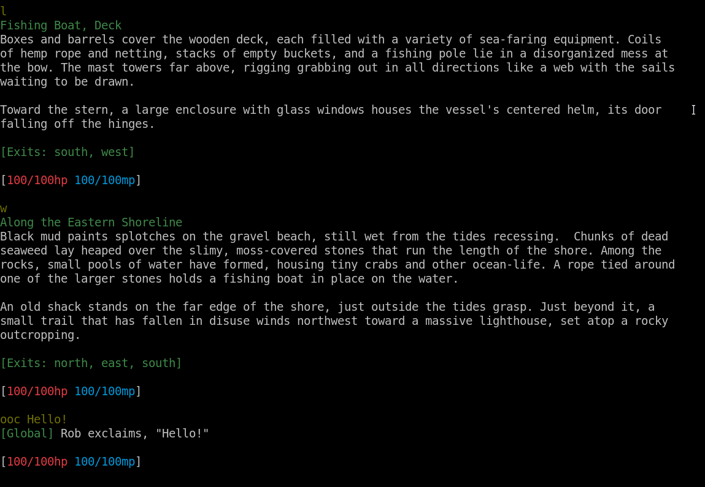

# 🌸 Blossom

<!-- markdownlint-disable -->

  <strong>Secure:</strong> blossom.sombia.com:5443
    &nbsp;&nbsp;&nbsp;&nbsp;&nbsp;
  <strong>Unsecure:</strong> blossom.sombia.com:5080
  
   Via Telnet: `telnet blossom.sombia.com 5080`

-----

    

<!-- markdownlint-enable -->

-----

Blossom is a MUD (Multi-User Dungeon) game engine written in Rust.

This is still an early work-in-progress and there will be sweeping, breaking
changes often as I refine the architecture and API. If you actually want to
build a MUD, you'd be best off using an existing codebase. Any of the old
C-bases, Evennia _(Python)_, or Ranvier _(JavaScript)_ are excellent options.

## Live Game

The test server listed at the top of the README should be online most of the
time, though the database may be reset at any time.

Connecting via Telnet: `telnet blossom.sombia.com 5080`

_In order to connect to the secure port, you must use a MUD client which
supports TLS encryption. I recommend __[Mudlet](https://www.mudlet.org/)__ for a
cross-platform option!_

## Architecture

See __[ARCHITECTURE.md](/ARCHITECTURE.md)__ for a high-level overview of the
underlying system design.

## Contributing

Prerequesites:

- Rust Nightly 1.69
- PostgreSQL 15

In addition, some _optional_ dev dependencies:

- Python 3.10 _(tooling)_
- SQLx CLI _(migrations)_
- NodeJS 19 _(dashboard / content creation tools / web client)_

Instructions to build:

1. `git clone https://github.com/robertwayne/blossom`
2. Modify the `.env.TEMPLATE` file in the root directory with your local
   Postgres details. _(This is neccesary for SQLx to do compile-time SQL
   validation)._
3. _(requires SQLx CLI)_ From the root directory, run `sqlx migrate run` to
   apply the schema.
4. Hack away!
5. _(requires SQLx CLI & Node)_ Run `./check.sh` before you open a PR. If you do
   not have the optional dependencies, run the commands manually.

_By contributing, you agree that any code submitted by you shall be
dual-licensed under MIT and Apache-2.0._

## License

Blossom source code is dual-licensed under either

- __[MIT License](/docs/LICENSE-MIT)__
- __[Apache License, Version 2.0](/docs/LICENSE-APACHE)__

at your option.
